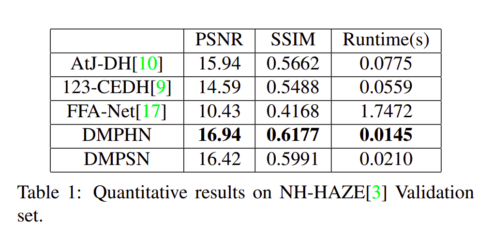
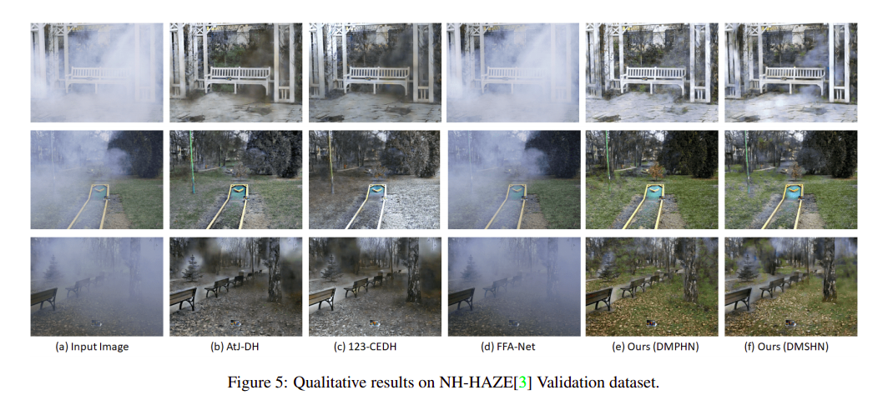

# Aerial Dehazing Experiments

This repository extends the original [Nonhomogeneous Image Dehazing](https://github.com/diptamath/Nonhomogeneous_Image_Dehazing.git) implementation by adapting the training and data workflow for aerial image dehazing experiments using synthetic haze generation and VSAI-style aerial imagery.

The project builds on the Fast Deep Multi-patch Hierarchical Network for Nonhomogeneous Image Dehazing, accepted at the NTIRE Workshop, CVPR 2020.

Preprint: https://arxiv.org/abs/2005.05999

## What Changed

- Retrained the DMPHN-based workflow for aerial image dehazing experiments.
- Added synthetic haze generation for clean aerial imagery.
- Added data preparation helpers for train, validation, and test file lists.
- Added model conversion, quantization, pruning, and Qualcomm AI Hub deployment experiments.

## Repository Layout

```text
models.py
loss.py
datasets.py

DMPHN_train.py
DMPHN_test.py
DMSHN_train.py
DMSHN_test.py

apply_haze.py
apply_haze_test.py
create_txt.py
prepare_image_data.py

convert.py
compile.py
inference.py
quantize_and_profile_test.py
dmphn_dynamic_quantize.py
dmphn_prune_quant_export.py

assets/
dataset/
new_dataset/
```

The `new_dataset/val/` folder contains a tiny validation set that can be used as a runnable demo input.

Model checkpoints are intentionally ignored by Git. Keep local weights under `checkpoints/`, or publish larger checkpoint files through GitHub Releases or another external storage location.

## Setup

Install the core dependencies:

```powershell
pip install -r requirements.txt
```

Optional dependencies for edge deployment and compression experiments:

```powershell
pip install -r requirements-edge.txt
```

## Running Inference

Place DMPHN checkpoint files under:

```text
checkpoints/DMPHN_1_2_4/
```

Expected files:

```text
encoder_lv1.pkl
encoder_lv2.pkl
encoder_lv3.pkl
decoder_lv1.pkl
decoder_lv2.pkl
decoder_lv3.pkl
```

Run:

```powershell
python DMPHN_test.py
```

For the DMSHN variant:

```powershell
python DMSHN_test.py
```

## Training

For training, image paths for train, validation, and test data should be listed in text files. For example, patch-level training expects hazy and ground-truth image paths in files such as:

```text
new_dataset/train_patch_hazy.txt
new_dataset/train_patch_gt.txt
```

Run:

```powershell
python DMPHN_train.py
python DMSHN_train.py
```

## Results From Original Paper

Quantitative results:



Qualitative results:



## Citation

Please cite the original paper if this project helps your research:

```bibtex
@InProceedings{Das_fast_deep_2020,
  author = {Sourya Dipta Das and Saikat Dutta},
  title = {Fast Deep Multi-patch Hierarchical Network for Nonhomogeneous Image Dehazing},
  booktitle = {The IEEE Conference on Computer Vision and Pattern Recognition (CVPR) Workshops},
  month = {June},
  year = {2020}
}
```

## License

This project is licensed under the MIT License. See [LICENSE](LICENSE) for details.
